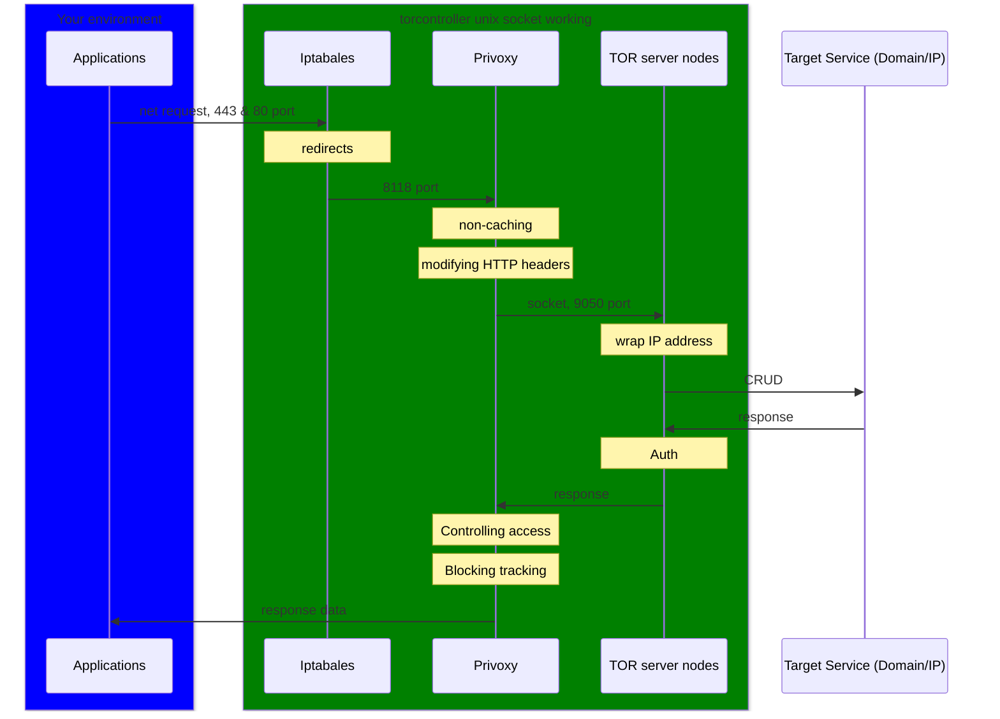

# torcontroller

[](https://github.com/Seicrypto/torcontroller/releases/latest)
[](https://github.com/Seicrypto/torcontroller/actions/workflows/test.yml)
[](https://codecov.io/gh/Seicrypto/torcontroller)
[](https://github.com/Seicrypto/torcontroller)
[](https://github.com/Seicrypto/torcontroller)

TorController is a CLI tool designed for [Tor VPN](https://www.torproject.org/) users that integrates commonly used features to make it easier for you to redirect and control your network through Tor.

- **Traffic Redirection**: Route all network requests through Tor.
- **IPv4 Support**: Focused on IPv4 networks and block IPv6.
- **Linux Compatibility**: Works on Linux systems, including Docker.
- **Speed Requirements**: Set minimum connection speeds for stability. [More](./docs/setting.md)
- **CLI Control**: Simple and efficient command-line operations.

If you are not reading this on github, please go to <https://github.com/Seicrypto/torcontroller>
Read more

Japanese README:
[日本語説明こちら](./READMEJP.md)

## QuickStart

  

Now torcontroller suport on Linux Debian / Ubuntu else.

Step1. Download and install

```bash
#!/bin/bash
apt-get update

# Intel / AMD cpu:
wget https://github.com/Seicrypto/torcontroller/releases/download/v1.0.1/torcontroller_1.0.1_amd64.deb
apt-get install -y ./torcontroller_1.1.0_amd64.deb

# ARM cpu:
# wget https://github.com/Seicrypto/torcontroller/releases/download/v1.0.1/torcontroller_1.0.1_arm64.deb
# apt-get install -y ./torcontroller_1.1.0_arm64.deb

# * How to know your machine using ARM or Intel / AMD
# uname -m
# Response :
# aarch64 (Means ARM)
# x86_64 (Means Intel / AMD)
```

Step2. Set up your AUTHENTICATE password

```bash
#!/bin/bash
torcontoller
# torcontroller instructions for use

torcontroller init
# Overwrite setting and random tor password
```

Step3. Start your using

```bash
curl http://icanhazip.com/
# 89.196.159.79 (a example your ture ip address)

#!/bin/bash
torcontroller start
# log info...
# Start command succeeded.

curl http://icanhazip.com/
# 176.10.99.200 (a example tor ip address)
```

## What does torcontroller do?

UML sequence diagram with mermaid:



Actually, there are more feature with privoxy and TOR. If you were interested in privoxy and TOR features, please visit thier sites. torcontroller only simple scripts to controll them.

## Reference

[tor.service file for systemctl](https://gist.github.com/gtank/f6a8f99c70f682cd8d4acd6a4a9ee696)

[privoxy.service file for systemctl](https://alt.os.linux.mageia.narkive.com/D2i3xOYQ/privoxy-service-file-for-systemd)

## Usage Disclaimer

This tool, **Torcontroller**, is developed to help users enhance their privacy and protect their online activities in lawful and ethical ways. It is strictly prohibited to use this tool for unauthorized access, illegal data scraping, or any activities that violate privacy laws (e.g., GDPR, CCPA) or ethical standards.

By using this tool, you agree to comply with all applicable laws and take full responsibility for your actions. The developers are not liable for any misuse or unlawful activities carried out with this tool.
