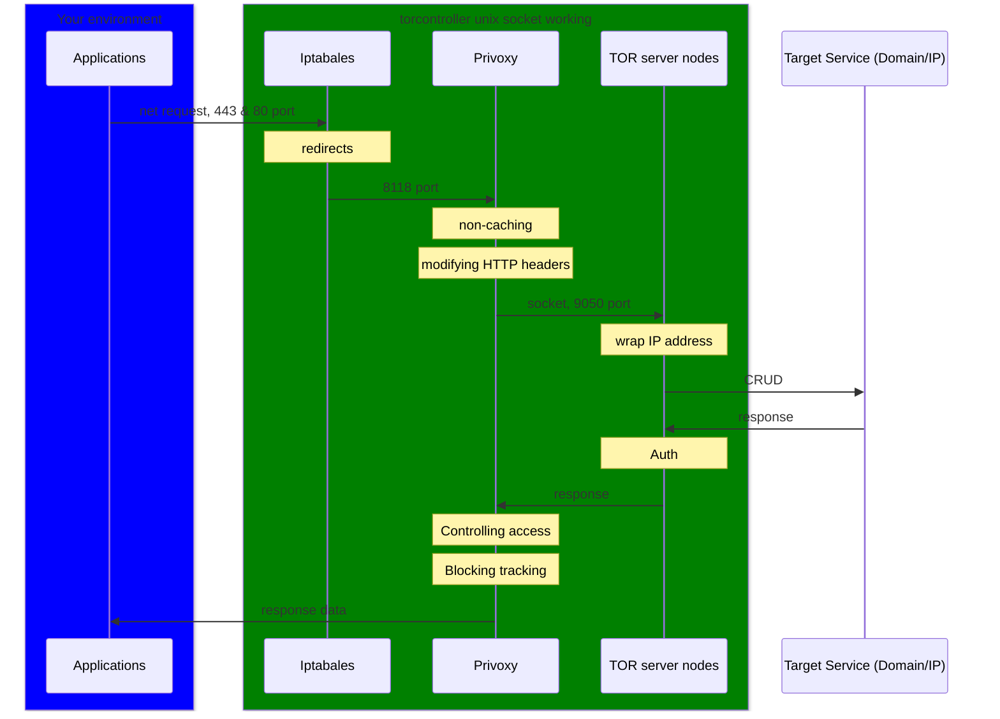

# torcontroller Japanese 日本語説明

[](https://github.com/Seicrypto/torcontroller/releases/latest)
[](https://github.com/Seicrypto/torcontroller/actions/workflows/test.yml)
[](https://codecov.io/gh/Seicrypto/torcontroller)
[](https://github.com/Seicrypto/torcontroller)
[](https://github.com/Seicrypto/torcontroller)

TorControllerは[Tor VPN](https://www.torproject.org/)ユーザのために設計されたCLIツールで、よく使われる機能を統合し、Torを介したネットワークのリダイレクトと制御を簡単にします。

## クイック・スタート

  

LinuxのDebian / Ubuntu以外でtorcontrollerが使えるようになりました。

ステップ1. ダウンロードしてインストールする

```bash
#!/bin/bash
apt-get update

# Intel / AMD cpu:
wget https://github.com/Seicrypto/torcontroller/releases/download/v1.0.1/torcontroller_1.0.1_amd64.deb
apt-get install -y ./torcontroller_1.0.1_amd64.deb

# ARM cpu:
# wget https://github.com/Seicrypto/torcontroller/releases/download/v1.0.1/torcontroller_1.0.1_arm64.deb
# apt-get install -y ./torcontroller_1.0.1_arm64.deb

# * ARMまたはIntel / AMDを使用しているマシンを知る方法
# uname -m
# 応答 :
# aarch64 (Means ARM)
# x86_64 (Means Intel / AMD)
```

ステップ2. 認証パスワードを設定する

```bash
#!/bin/bash
torcontoller
# torcontroller instructions for use

torcontroller init
# Overwrite setting and random tor password
```

ステップ3. 使用開始

```bash
curl http://icanhazip.com/
# 89.196.159.79 (a example your ture ip address)

#!/bin/bash
torcontroller start
# log info...
# Start command succeeded.

curl http://icanhazip.com/
# 176.10.99.200 (a example tor ip address)
```

## torcontrollerは何をするの？

UML sequence diagram with mermaid:



実際、privoxyとTORにはもっと多くの機能があります。もし、privoxyやTORの機能に興味があるのであれば、それぞれのサイトを見てください。

## Reference

[A step-by-step guide how to use Python with Tor and Privoxy](https://gist.github.com/DusanMadar/8d11026b7ce0bce6a67f7dd87b999f6b) :

Which is my basic script content reference.

[tor.service file for systemctl](https://gist.github.com/gtank/f6a8f99c70f682cd8d4acd6a4a9ee696)

[privoxy.service file for systemctl](https://alt.os.linux.mageia.narkive.com/D2i3xOYQ/privoxy-service-file-for-systemd)

## 使用に関する免責事項

このツール、**Torcontroller**は、ユーザーのプライバシーを強化し、合法的かつ倫理的な方法でオンライン活動を保護するために開発されました。このツールを不正アクセス、違法なデータスクレイピング、またはプライバシー法（GDPR、CCPAなど）や倫理基準に違反する活動に使用することは固く禁じられています。

このツールを使用することで、適用されるすべての法律を遵守し、自分の行動に全責任を負うことに同意するものとします。開発者は、このツールを使用して行われた誤用または違法行為について責任を負いません。
